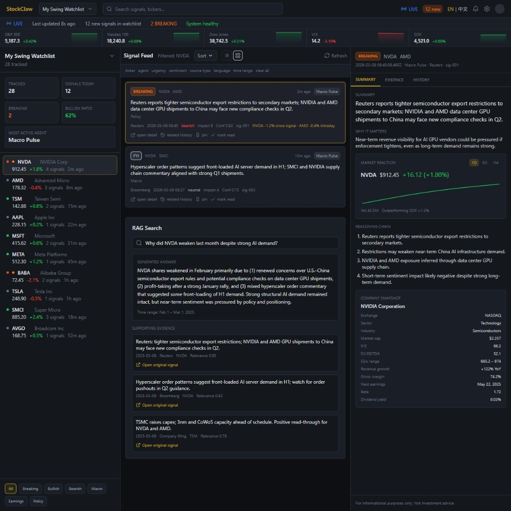
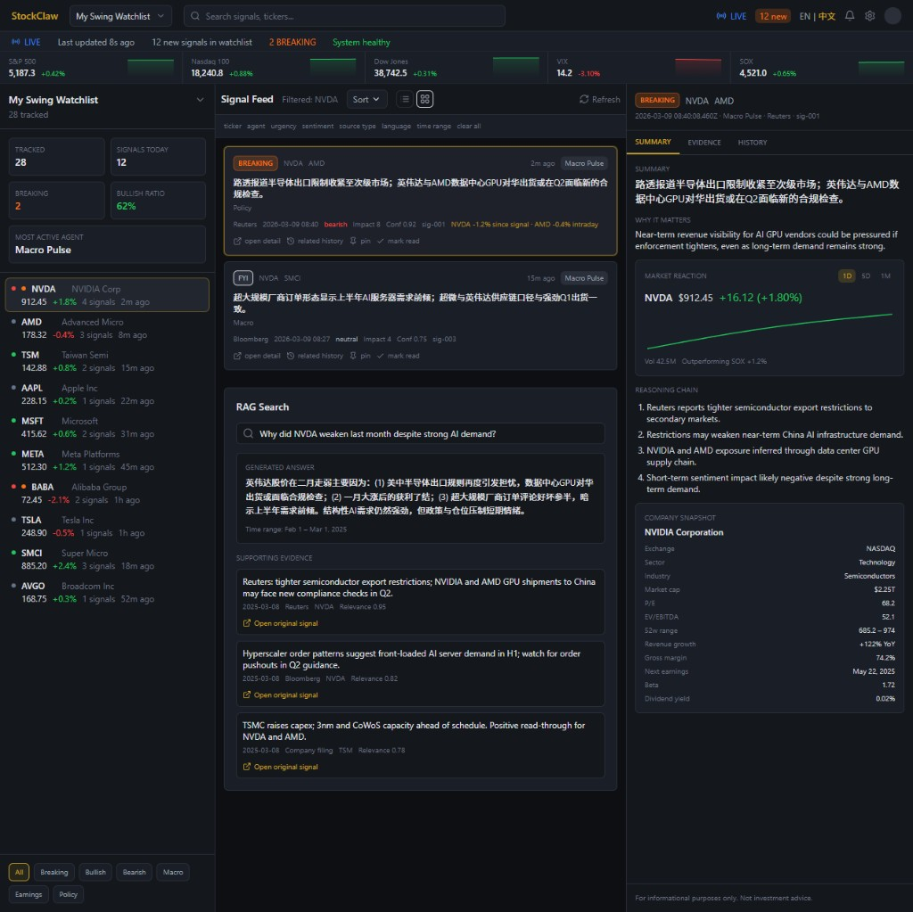

# StockClaw Demo Layout (v2)

A dark-themed, high-density **market intelligence terminal** UI prototype for StockClaw. This demo focuses on AI signals, reasoning, and evidence, with supporting market context and company fundamentals—not a trading or execution app.

## Features

- **Global market context strip** — S&P 500, Nasdaq 100, Dow, VIX, SOX with level, daily % change, and sparklines
- **Left watchlist** — Tickers with current price, daily % move, signal count, and last signal age
- **Center signal feed** — Filterable signal cards with optional inline market-reaction hints
- **Right analyst panel** — Signal header, expanded summary, **Market Reaction** (price + mini chart, 1D/5D/1M), reasoning chain, **Company Snapshot** (fundamentals), Evidence and History tabs

All data is **mock**; no backend or real API calls.

## Tech

- React 18, TypeScript, Vite  
- Tailwind CSS, lucide-react, Recharts (sparklines and mini line charts)

## Run

From this directory:

```bash
npm install
npm run dev
```

Then open the URL shown (e.g. `http://localhost:5173`).

## Screenshots

**Overview** — Market strip, watchlist with price context, signal feed with NVDA filtered, and RAG block.



**Signal detail** — Summary tab with Market Reaction module (price, mini chart, timeframe toggle), Reasoning Chain, and Company Snapshot (fundamentals). Language set to 中文 for summary.



## Layout

- **Top:** Header (logo, watchlist, search, LIVE/status) → Status strip → **Market context strip**
- **Body:** Three columns — Watchlist | Signal feed | Signal detail (with Market Reaction + Company Snapshot)

## License

Part of the StockClaw frontend prototype. For informational purposes only; not investment advice.
